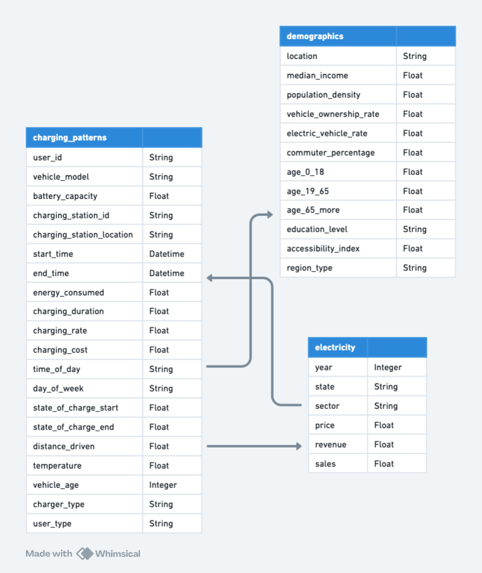

# EV Charging Behavior Analysis - Project Overview

## Project Background

The rapid adoption of electric vehicles (EVs) worldwide is reshaping the automotive and energy industries. 

As governments push for more sustainable transportation and individuals switch to EVs to reduce carbon footprints, the demand for efficient and affordable EV charging infrastructure continues to grow. 

However, meeting this demand requires a deep understanding of charging behaviors, electricity pricing structures, and regional demographics.

Insights and recommendations are provided on the following key areas:

**1. Charging Behavior Analysis:**
**Insight:** Identify peak charging hours, preferred charging locations, and user types (e.g., commuters, long-distance drivers).

**2. Electricity Pricing Impact:**
**Insight:** Correlate electricity costs with energy consumption patterns to understand price sensitivity.

**3. Demographic Influence on EV Adoption:**
**Insight:** Higher-income regions and areas with better education levels show greater EV adoption and higher charging station usage.

## ⚠️ **Disclaimer**  
> This analysis focuses on **Chicago**, **Houston**, **Los Angeles**, **New York**, and **San Francisco**, using publicly available datasets.

## Dataset Structure

## Insights Summary

In order to evaluate performance in this case study, we focused on the following key metrics:

1. **Energy Consumed per Session (kWh):**
- Measures the total energy consumed during a charging session.
- Purpose: Helps evaluate charging patterns and infrastructure demand.

2. **Charging Session Duration (Hours):**
- Tracks the time spent at a charging station for a single session.
- Purpose: Assesses station efficiency and user convenience.

3. **Revenue per Charging Station (USD):**
- Calculates the revenue generated per station based on energy usage and pricing.
- Formula: Energy Consumed (kWh) * Price (USD/kWh)
- Purpose: Determines the profitability of charging infrastructure.

4. **Peak Usage Hours:**
- Identifies the hours during the day with the highest charging activity.
- Purpose: Guides scheduling for maintenance and expansion.

5. **Electric Vehicle Penetration Rate:**
- Measures the percentage of electric vehicles in a region compared to total vehicles.
- Purpose: Highlights regions with high adoption rates for targeted infrastructure investments.

6. **Charging Station Utilization Rate:**
- Tracks the percentage of time a station is actively used compared to its availability.
- Formula: (Active Charging Time / Total Available Time) * 100
- Purpose: Indicates whether stations are over- or under-utilized.

7. **Electricity Cost per kWh:**
- Evaluates the average price users pay for charging electricity.
- Purpose: Assesses the impact of electricity pricing on user behavior and revenue.

8. **Distance Traveled Since Last Charge (km):**
- Tracks how far users travel before needing to recharge.
- Purpose: Provides insights into user driving habits and the sufficiency of battery capacities.

9. **Age Group Utilization Breakdown (%):**
- Analyzes which age groups (0-18, 19-65, 65+) most frequently use charging stations.
- Purpose: Identifies target demographics for EV adoption campaigns.

10. **Charging Session Revenue per User Type (USD):**
- Compares revenue contributions by user types (e.g., commuters vs. long-distance drivers).
- Purpose: Tailors infrastructure and pricing strategies to different user segments.

## Schema

### Electric Vehicle Charging Patterns

| **Column Name**             | **Data Type**      | **Description**                                                                                  |
|-----------------------------|--------------------|--------------------------------------------------------------------------------------------------|
| `user_id`                   | STRING       | Unique identifier for each user (e.g., `user_1`).                                               |
| `vehicle_model`             | STRING      | Specific model of the electric vehicle (e.g., `BMW i3`).                                        |
| `battery_capacity`      | FLOAT       | Maximum energy storage of the vehicle's battery in kilowatt-hours (e.g., `108.4630074`).        |
| `charging_station_id`       | STRING       | Unique identifier for the charging station used (e.g., `station_391`).                         |
| `charging_station_location` | STRING      | Geographic location of the charging station (e.g., `Houston`).                                  |
| `start_time`                | DATETIME          | Timestamp for when the charging session began (e.g., `1/1/24 0:00`).                           |
| `end_time`                  | DATETIME          | Timestamp for when the charging session ended (e.g., `1/1/24 0:39`).                           |
| `energy_consumed`       | FLOAT       | Total energy consumed during the charging session, in kilowatt-hours (e.g., `60.71234573`).     |
| `charging_duration`   | FLOAT       | Total time taken to charge the vehicle, in hours (e.g., `0.591363425`).                         |
| `charging_rate`          | FLOAT       | Average power delivery rate during the session, in kilowatts (e.g., `36.38918057`).             |
| `charging_cost`         | FLOAT       | Total cost of the charging session in US dollars (e.g., `13.08771679`).                         |
| `time_of_day`               | STRING       | Time segment when charging occurred (e.g., `evening`).                                          |
| `day_of_week`               | STRING       | Day when the charging occurred (e.g., `tuesday`).                                               |
| `state_of_charge_start`     | FLOAT       | Battery percentage at the start of charging (e.g., `29.37157598`).                              |
| `state_of_charge_end`       | FLOAT       | Battery percentage at the end of charging (e.g., `86.11996244`).                                |
| `distance_driven`           | FLOAT       | Distance traveled since the last charge, in kilometers (e.g., `293.6021106`).                   |
| `temperature`               | FLOAT       | Ambient temperature during the session, in degrees Celsius (e.g., `27.94795306`).              |
| `vehicle_age`               | INTEGER           | Age of the electric vehicle, in years (e.g., `2`).                                              |
| `charger_type`              | STRING       | Type of charger used (e.g., `DC Fast Charger`).                                                 |
| `user_type`                 | STRING       | Classification of user based on driving habits (e.g., `Commuter`).                              |

*Dataset Name: EV Charging Patterns*  
*Source: [EV Charging Patterns](https://www.kaggle.com/code/jaishumeda/ev-charging-patterns/)*  
*Description: This dataset provides charging session details, including energy consumed, charging duration, vehicle details, and user classifications. It enables insights into electric vehicle (EV) charging behavior and usage patterns.*

### Demographic and Socioeconomic Data Table

| **Column Name**            | **Data Type**    | **Description**                                                                                     |
|----------------------------|------------------|-----------------------------------------------------------------------------------------------------|
| `location`                 | STRING           | Name of the city or locality.                                                                      |
| `median_income`            | FLOAT            | Median household income in the region (in USD).                                                    |
| `population_density`       | FLOAT            | Number of people per square kilometer.                                                             |
| `vehicle_ownership_rate`   | FLOAT            | Percentage of households in the region that own at least one vehicle.                              |
| `electric_vehicle_rate`    | FLOAT            | Percentage of vehicles in the region that are electric.                                            |
| `commuter_percentage`      | FLOAT            | Percentage of the population identified as commuters (traveling daily for work).                   |
| `age_0_18`                 | FLOAT            | Percentage of the population aged 0–18 years.                                                     |
| `age_19_65`                | FLOAT            | Percentage of the population aged 19–65 years.                                                    |
| `age_65_plus`              | FLOAT            | Percentage of the population aged 65+ years.                                                      |
| `education_level`          | STRING           | Most common education levels.                                                                      |
| `accessibility_index`      | FLOAT            | A score indicating infrastructure accessibility for underserved populations (1–10 scale).          |
| `region_type`              | STRING           | Type of area (e.g., Urban, Suburban, Rural).                                                       |

*Source: US Census Bureau, World Bank Open Data.*

### U.S. Electricity Prices

| **Column Name**       | **Data Type**      | **Description**                                                                              |
|-----------------------|--------------------|----------------------------------------------------------------------------------------------|
| `year`                | INTEGER            | The year for the data entry (e.g., `2023`).                                                |                         |
| `state`               | STRING             | The name of the state or region (e.g., `California`, `Texas`).                             |
| `sector_name`         | STRING             | The name of the sector electricity was provided to (e.g., `Residential`, `Industrial`).    |
| `price`               | FLOAT              | The price of electricity in cents per kilowatt-hour (e.g., `12.34`).                       |
| `revenue`             | FLOAT              | The revenue generated from sales in millions of dollars (e.g., `123.45`).                  |
| `sales`               | FLOAT              | The sales of electricity in million kilowatt-hours (e.g., `456.78`).                       |

*Dataset Name: U.S. Electricity Prices*
*Source: [U.S. Electricity Prices](https://www.kaggle.com/datasets/alistairking/electricity-prices)*  
*Description: This dataset includes information on electricity prices, revenues, and sales across different sectors (e.g., Residential, Industrial) and regions. It provides insights into electricity consumption patterns, pricing trends, and revenue generation over time.*  
